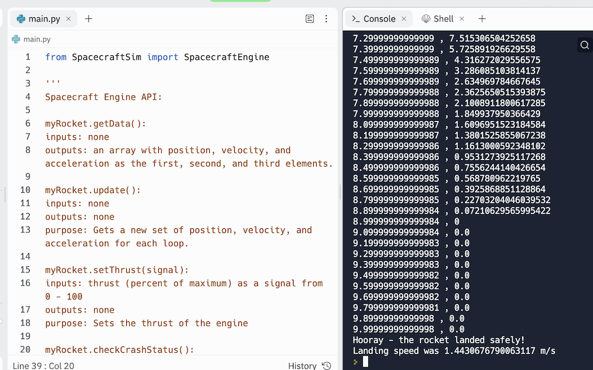
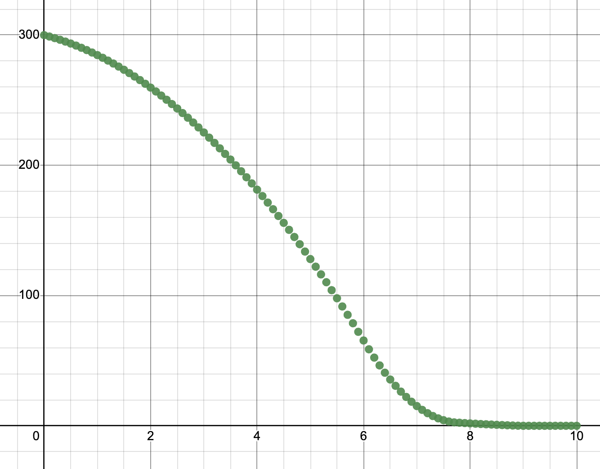

# Landing a Rocket

The simulation is located at [https://replit.com/@kreier/LandingRocket](https://replit.com/@kreier/LandingRocket). You have several inputs:

- data = myRocket.getData() gives you a list of values for the y-direction
- data[0] is height in meters
- data[1] is velocity in m/s
- data[2] is acceleration

As output you only control currentTrust with:
- 

Running the simulation could look like this:

And if you export the data pairs to https://www.desmos.com/calculator you get a graph like:

But you have to write your own code and feedback control loop to get it working with every height you put in! Some myRocket.setThrust(20.88) works after 60 seconds.
