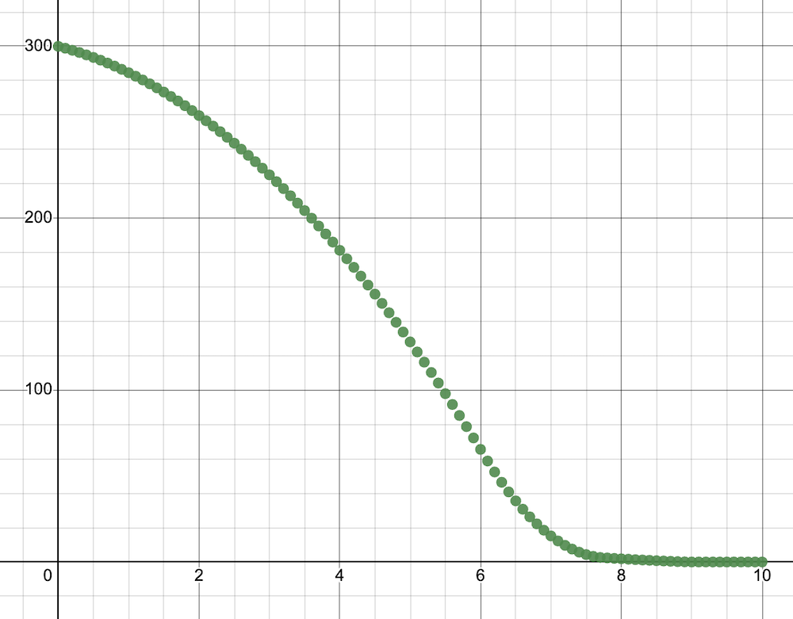

# Examples of Control Systems

These are the files we used in class with the Sphero RVR for control and API

## Examples to use Feedback control Loops

1. on/off control
2. on/off control with tolerance
3. proportional control
4. proportional-integral control
5. proportional-integral-derivative control, see [PID controller on wikipedia](https://en.wikipedia.org/wiki/PID_controller)

## Platforms

- VEX VR https://vr.vex.com
- Sphero RVR
- Motorized arm: both https://p5js.org and physical VEX V5
- TemperatureControlSimulator in https://p5js.org

## Simulations

### Landing a Rocket - [simulation on replit](https://replit.com/@kreier/LandingRocket)

### Controlling a water valve - [simulation on p5js](https://editor.p5js.org/mkreier/sketches/1oCHPXX3T)

### Controlling a robot arm to a specific angle just with torque - [simulation on p5js](https://editor.p5js.org/mkreier/sketches/nGUH6r8OU)

